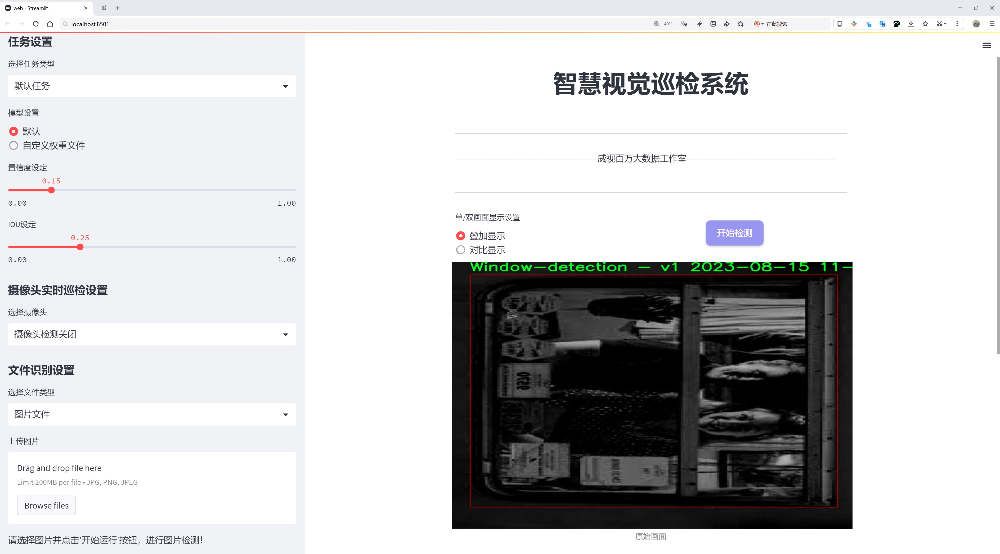
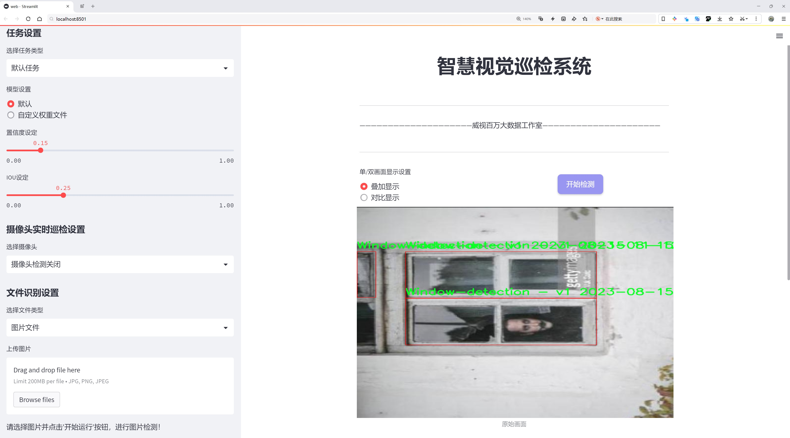
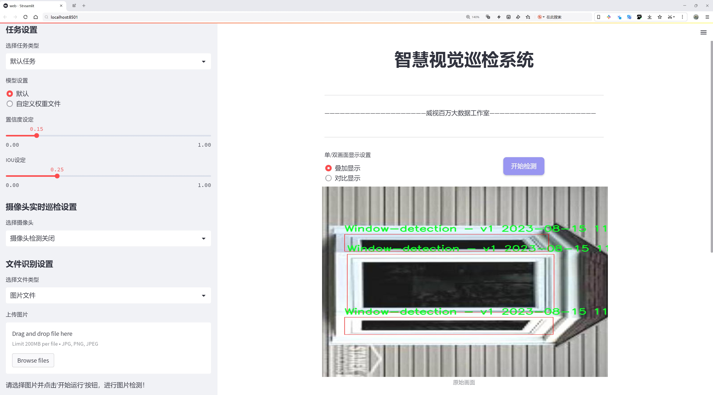
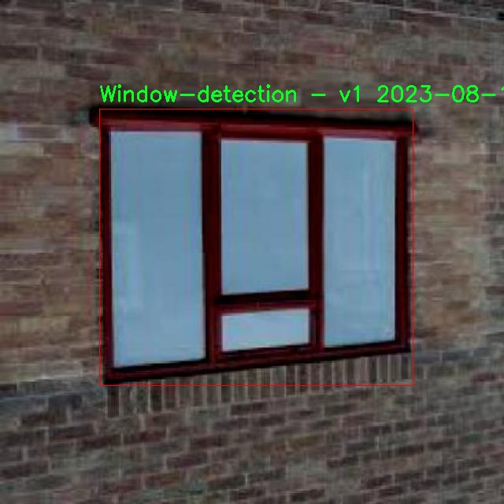
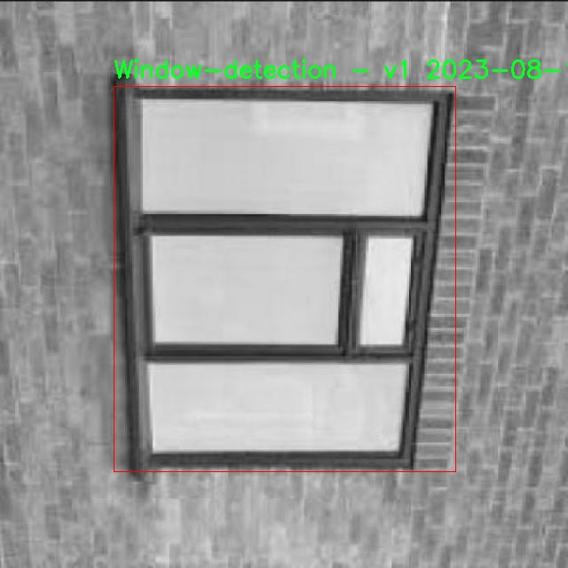
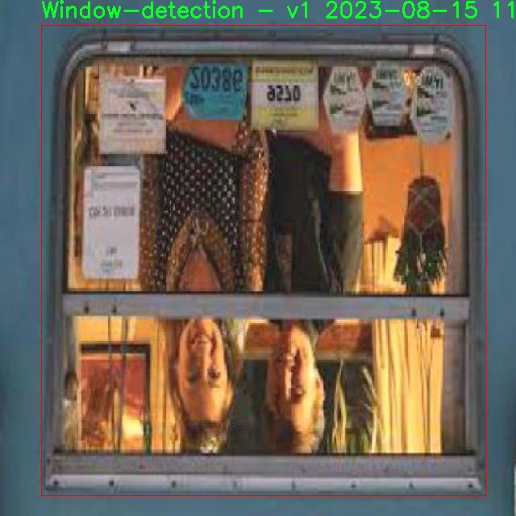
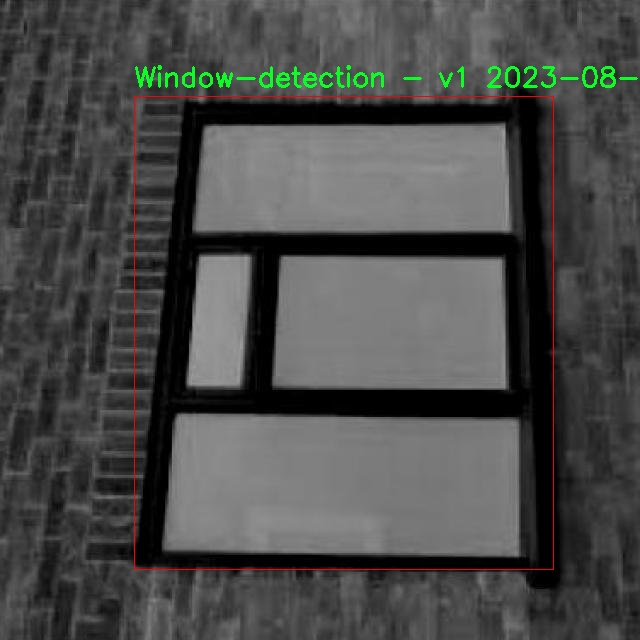
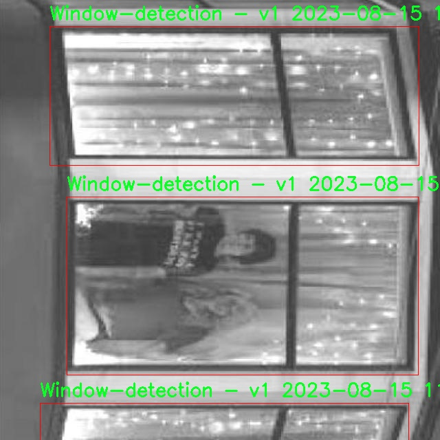

# 窗户检测检测系统源码分享
 # [一条龙教学YOLOV8标注好的数据集一键训练_70+全套改进创新点发刊_Web前端展示]

### 1.研究背景与意义

项目参考[AAAI Association for the Advancement of Artificial Intelligence](https://gitee.com/qunshansj/projects)

项目来源[AACV Association for the Advancement of Computer Vision](https://gitee.com/qunmasj/projects)

研究背景与意义

随着城市化进程的加快，建筑物的数量不断增加，窗户作为建筑物的重要组成部分，其检测与识别在智能建筑管理、安防监控、环境监测等领域具有重要的应用价值。窗户的自动检测不仅可以提高建筑物的管理效率，还可以为智能家居、智慧城市的建设提供数据支持。传统的窗户检测方法多依赖于人工标注和经验判断，效率低下且易受人为因素影响，难以满足现代化管理的需求。因此，基于深度学习的自动化窗户检测系统应运而生，成为研究的热点。

YOLO（You Only Look Once）系列模型因其在实时目标检测中的优越性能而受到广泛关注。YOLOv8作为该系列的最新版本，进一步提升了检测精度和速度，适合于复杂环境下的目标检测任务。然而，尽管YOLOv8在多种目标检测任务中表现出色，但在特定领域，如窗户检测，仍存在一定的局限性。窗户的形状、大小、颜色及其在不同光照条件下的表现差异，使得传统的YOLOv8模型在窗户检测时可能面临准确率不足和漏检的问题。因此，改进YOLOv8以适应窗户检测的特殊需求，成为了本研究的核心目标。

本研究所使用的数据集包含4800张窗户图像，经过精心标注，确保了数据的高质量和多样性。该数据集的建立为模型的训练和验证提供了坚实的基础。通过对该数据集的深入分析，我们可以发现窗户在不同建筑风格、不同光照条件下的表现差异，这为模型的改进提供了重要的参考依据。此外，数据集中窗户的多样性也为模型的泛化能力提出了挑战，只有通过有效的改进，才能使模型在实际应用中表现出色。

在技术层面，改进YOLOv8的窗户检测系统将结合多种先进的深度学习技术，如数据增强、迁移学习和特征融合等，旨在提升模型的检测精度和鲁棒性。通过引入这些技术，我们希望能够克服传统YOLOv8在窗户检测中的不足，实现在各种复杂环境下的高效检测。这不仅有助于推动目标检测技术的发展，也为窗户检测的实际应用提供了新的解决方案。

综上所述，基于改进YOLOv8的窗户检测系统的研究，不仅具有重要的理论意义，也具备广泛的实际应用前景。随着智能建筑和智慧城市的不断发展，窗户检测的需求将愈加迫切。本研究的成果将为相关领域提供有力的技术支持，推动建筑管理、安防监控等行业的智能化进程，具有重要的社会和经济价值。

### 2.图片演示







##### 注意：由于此博客编辑较早，上面“2.图片演示”和“3.视频演示”展示的系统图片或者视频可能为老版本，新版本在老版本的基础上升级如下：（实际效果以升级的新版本为准）

  （1）适配了YOLOV8的“目标检测”模型和“实例分割”模型，通过加载相应的权重（.pt）文件即可自适应加载模型。

  （2）支持“图片识别”、“视频识别”、“摄像头实时识别”三种识别模式。

  （3）支持“图片识别”、“视频识别”、“摄像头实时识别”三种识别结果保存导出，解决手动导出（容易卡顿出现爆内存）存在的问题，识别完自动保存结果并导出到tempDir中。

  （4）支持Web前端系统中的标题、背景图等自定义修改，后面提供修改教程。

  另外本项目提供训练的数据集和训练教程,暂不提供权重文件（best.pt）,需要您按照教程进行训练后实现图片演示和Web前端界面演示的效果。

### 3.视频演示

[3.1 视频演示](https://www.bilibili.com/video/BV16stXeyEJr/)

### 4.数据集信息展示

##### 4.1 本项目数据集详细数据（类别数＆类别名）

nc: 1
names: ['Window-detection - v1 2023-08-15 11-12pm']


##### 4.2 本项目数据集信息介绍

数据集信息展示

在本研究中，我们使用了名为“lll”的数据集，旨在改进YOLOv8的窗户检测系统。该数据集专门针对窗户检测任务进行了精心设计，具有独特的结构和内容，以确保模型能够在各种环境下有效识别窗户。数据集的类别数量为1，具体类别列表中包含了“Window-detection - v1 2023-08-15 11-12pm”，这一命名不仅标识了数据集的用途，还提供了创建的时间信息，便于追踪和版本管理。

“lll”数据集的构建过程经过了严格的筛选和标注，确保了数据的高质量和高准确性。数据集中的图像来源多样，涵盖了不同类型的建筑物、窗户样式和光照条件。这种多样性使得模型在训练过程中能够接触到各种可能的窗户特征，从而提高其泛化能力和鲁棒性。每一张图像都经过精确的标注，确保窗户的边界框位置准确无误，这对于YOLOv8模型的训练至关重要。

此外，数据集的设计还考虑到了实际应用中的挑战。例如，窗户的反射、遮挡以及不同的视角等因素都被纳入了数据集的考虑范围。通过在数据集中引入这些复杂场景，模型能够更好地应对现实世界中的多变情况，从而提升其在实际应用中的表现。

在数据集的使用过程中，我们采用了数据增强技术，以进一步提升模型的训练效果。通过对图像进行旋转、缩放、翻转和颜色调整等操作，生成了更多的训练样本。这不仅增加了数据集的多样性，还帮助模型在训练过程中学习到更为丰富的特征，提高了其对窗户的检测能力。

“lll”数据集的应用不仅限于YOLOv8的训练，还可以为后续的研究提供宝贵的参考。随着窗户检测技术的不断发展，未来可能会有更多的改进和扩展。研究人员可以基于此数据集进行不同算法的比较，探索更为先进的检测方法，推动窗户检测领域的进步。

总之，“lll”数据集在窗户检测任务中的重要性不言而喻。它不仅为YOLOv8模型的训练提供了坚实的基础，还为未来的研究提供了丰富的资源。通过不断优化和扩展数据集，我们有望在窗户检测领域取得更大的突破，推动智能视觉技术的进一步发展。











### 5.全套项目环境部署视频教程（零基础手把手教学）

[5.1 环境部署教程链接（零基础手把手教学）](https://www.ixigua.com/7404473917358506534?logTag=c807d0cbc21c0ef59de5)


[5.2 安装Python虚拟环境创建和依赖库安装视频教程链接（零基础手把手教学）](https://www.ixigua.com/7404474678003106304?logTag=1f1041108cd1f708b01a)

### 6.手把手YOLOV8训练视频教程（零基础小白有手就能学会）

[6.1 手把手YOLOV8训练视频教程（零基础小白有手就能学会）](https://www.ixigua.com/7404477157818401292?logTag=d31a2dfd1983c9668658)

### 7.70+种全套YOLOV8创新点代码加载调参视频教程（一键加载写好的改进模型的配置文件）

[7.1 70+种全套YOLOV8创新点代码加载调参视频教程（一键加载写好的改进模型的配置文件）](https://www.ixigua.com/7404478314661806627?logTag=29066f8288e3f4eea3a4)

### 8.70+种全套YOLOV8创新点原理讲解（非科班也可以轻松写刊发刊，V10版本正在科研待更新）

由于篇幅限制，每个创新点的具体原理讲解就不一一展开，具体见下列网址中的创新点对应子项目的技术原理博客网址【Blog】：


[8.1 70+种全套YOLOV8创新点原理讲解链接](https://gitee.com/qunmasj/good)

### 9.系统功能展示（检测对象为举例，实际内容以本项目数据集为准）

图9.1.系统支持检测结果表格显示

  图9.2.系统支持置信度和IOU阈值手动调节

  图9.3.系统支持自定义加载权重文件best.pt(需要你通过步骤5中训练获得)

  图9.4.系统支持摄像头实时识别

  图9.5.系统支持图片识别

  图9.6.系统支持视频识别

  图9.7.系统支持识别结果文件自动保存

  图9.8.系统支持Excel导出检测结果数据


### 10.原始YOLOV8算法原理

原始YOLOv8算法原理

YOLOv8算法是目标检测领域的一次重要突破，它在YOLO系列的基础上进行了多项创新和优化，旨在提高检测精度和速度。作为2023年由Ultralytics公司发布的最新版本，YOLOv8不仅延续了前几代算法的优点，还在多个方面进行了深度改进，特别是在网络结构、损失函数和样本匹配策略等方面。

首先，YOLOv8的网络结构采用了CSP（Cross Stage Partial）设计理念，这一结构的核心在于通过分流的方式提取特征，增强了模型的表达能力。YOLOv8在主干网络中将YOLOv5的C3模块替换为C2F模块，这一改进使得模型在保持轻量化的同时，能够并行处理更多的梯度流分支，从而获得更丰富的特征信息。这种结构的优化不仅提高了模型的精度，还有效降低了计算延迟，确保了实时目标检测的需求。

在特征提取方面，YOLOv8保留了空间金字塔池化（SPPF）模块，这一模块的引入使得模型能够更好地处理不同尺度的目标，增强了对小目标的检测能力。同时，YOLOv8在颈部网络中采用了PAN-FPN（Path Aggregation Network - Feature Pyramid Network）结构，进一步提升了特征的多尺度融合能力。这种设计允许模型在不同层次上提取和融合特征，从而更全面地理解图像内容。

YOLOv8在检测网络的设计上也进行了重要的创新，采用了Anchor-Free的检测方式，摒弃了传统的Anchor-Based方法。传统方法依赖于预设的锚框，这不仅增加了计算复杂度，还限制了模型的灵活性。YOLOv8通过将目标检测转化为关键点检测，简化了模型的设计，使得模型能够自适应地处理不同形状和大小的目标。这种转变大大增强了模型的泛化能力，使其在各种复杂场景下都能表现出色。

损失函数的设计是YOLOv8的一大亮点。算法引入了变焦损失（Focal Loss）来计算分类损失，并使用数据平均保真度损失和完美交并比损失来计算边界框损失。这种新的损失策略使得模型在训练过程中能够更有效地聚焦于难以检测的目标，提高了整体的检测精度。通过对损失函数的精细调整，YOLOv8能够更好地应对类别不平衡的问题，确保每个类别的目标都能得到充分的学习。

在输入数据处理方面，YOLOv8采用了自适应图片缩放技术，以提高目标检测和推理的速度。通过将长边按比例缩小到指定尺寸，并对短边进行填充，YOLOv8能够有效减少信息冗余，提升模型的效率。此外，YOLOv8在训练过程中使用了Mosaic数据增强技术，这一方法通过将多张图像拼接成一张新图像，迫使模型学习到更多的上下文信息，从而提高了模型的鲁棒性和预测精度。

总的来说，YOLOv8算法通过一系列的结构优化和创新，提升了目标检测的性能和灵活性。其在骨干网络、颈部网络、检测头和损失函数等多个方面的改进，使得YOLOv8在复杂的目标检测任务中表现出色，成为当前最优秀的目标检测算法之一。通过这些技术的结合，YOLOv8不仅在准确性上有了显著提升，同时也在计算效率上达到了新的高度，适应了日益增长的实时检测需求。未来，YOLOv8有望在更多的应用场景中发挥重要作用，推动目标检测技术的进一步发展。


### 11.项目核心源码讲解（再也不用担心看不懂代码逻辑）

#### 11.1 70+种YOLOv8算法改进源码大全和调试加载训练教程（非必要）\ultralytics\data\dataset.py

以下是经过精简和注释的核心代码部分，主要包括 `YOLODataset` 和 `ClassificationDataset` 类的实现。为了便于理解，我将对每个重要部分进行详细的中文注释。

```python
import contextlib
from itertools import repeat
from multiprocessing.pool import ThreadPool
from pathlib import Path
import cv2
import numpy as np
import torch
import torchvision
from ultralytics.utils import TQDM, get_hash, img2label_paths, verify_image_label, LOGGER

# Ultralytics 数据集缓存版本
DATASET_CACHE_VERSION = '1.0.3'

class YOLODataset(BaseDataset):
    """
    YOLO 数据集类，用于加载目标检测和/或分割标签。
    """

    def __init__(self, *args, data=None, use_segments=False, use_keypoints=False, **kwargs):
        """初始化 YOLODataset，配置分割和关键点选项。"""
        self.use_segments = use_segments  # 是否使用分割掩码
        self.use_keypoints = use_keypoints  # 是否使用关键点
        self.data = data
        assert not (self.use_segments and self.use_keypoints), '不能同时使用分割和关键点。'
        super().__init__(*args, **kwargs)

    def cache_labels(self, path=Path('./labels.cache')):
        """
        缓存数据集标签，检查图像并读取形状。
        """
        x = {'labels': []}  # 存储标签的字典
        nm, nf, ne, nc, msgs = 0, 0, 0, 0, []  # 统计信息
        total = len(self.im_files)  # 图像文件总数

        # 使用多线程验证图像和标签
        with ThreadPool(NUM_THREADS) as pool:
            results = pool.imap(func=verify_image_label,
                                iterable=zip(self.im_files, self.label_files, repeat(self.prefix),
                                             repeat(self.use_keypoints), repeat(len(self.data['names']))))
            pbar = TQDM(results, desc='扫描中...', total=total)
            for im_file, lb, shape, segments, keypoint, nm_f, nf_f, ne_f, nc_f, msg in pbar:
                nm += nm_f
                nf += nf_f
                ne += ne_f
                nc += nc_f
                if im_file:
                    x['labels'].append(
                        dict(
                            im_file=im_file,
                            shape=shape,
                            cls=lb[:, 0:1],  # 类别
                            bboxes=lb[:, 1:],  # 边界框
                            segments=segments,
                            keypoints=keypoint,
                            normalized=True,
                            bbox_format='xywh'))  # 边界框格式
                if msg:
                    msgs.append(msg)
                pbar.desc = f'扫描中... {nf} 图像, {nm + ne} 背景, {nc} 损坏'

        if nf == 0:
            LOGGER.warning(f'警告 ⚠️ 在 {path} 中未找到标签。')
        x['hash'] = get_hash(self.label_files + self.im_files)  # 生成标签哈希
        save_dataset_cache_file(self.prefix, path, x)  # 保存缓存
        return x

    def get_labels(self):
        """返回 YOLO 训练的标签字典。"""
        self.label_files = img2label_paths(self.im_files)  # 获取标签文件路径
        cache_path = Path(self.label_files[0]).parent.with_suffix('.cache')  # 缓存文件路径
        try:
            cache, exists = load_dataset_cache_file(cache_path), True  # 尝试加载缓存文件
            assert cache['version'] == DATASET_CACHE_VERSION  # 检查版本
            assert cache['hash'] == get_hash(self.label_files + self.im_files)  # 检查哈希
        except (FileNotFoundError, AssertionError):
            cache, exists = self.cache_labels(cache_path), False  # 运行缓存操作

        # 读取缓存
        labels = cache['labels']
        if not labels:
            LOGGER.warning(f'警告 ⚠️ 在 {cache_path} 中未找到图像，训练可能无法正常工作。')
        self.im_files = [lb['im_file'] for lb in labels]  # 更新图像文件列表
        return labels

    def build_transforms(self, hyp=None):
        """构建并返回数据增强变换列表。"""
        transforms = []  # 初始化变换列表
        # 根据配置构建变换
        transforms.append(
            Format(bbox_format='xywh', normalize=True, return_mask=self.use_segments, return_keypoint=self.use_keypoints))
        return transforms

class ClassificationDataset(torchvision.datasets.ImageFolder):
    """
    YOLO 分类数据集类。
    """

    def __init__(self, root, args, augment=False, cache=False, prefix=''):
        """初始化 YOLO 分类数据集。"""
        super().__init__(root=root)
        self.prefix = f'{prefix}: ' if prefix else ''
        self.cache_ram = cache is True or cache == 'ram'  # 是否在内存中缓存图像
        self.cache_disk = cache == 'disk'  # 是否在磁盘上缓存图像
        self.samples = self.verify_images()  # 验证图像

    def __getitem__(self, i):
        """返回给定索引的样本和目标。"""
        f, j, fn, im = self.samples[i]  # 获取样本信息
        im = cv2.imread(f)  # 读取图像
        sample = self.torch_transforms(im)  # 应用变换
        return {'img': sample, 'cls': j}  # 返回图像和类别

    def __len__(self) -> int:
        """返回数据集中的样本总数。"""
        return len(self.samples)

    def verify_images(self):
        """验证数据集中的所有图像。"""
        samples = []  # 存储有效样本
        # 使用多线程验证图像
        with ThreadPool(NUM_THREADS) as pool:
            results = pool.imap(func=verify_image, iterable=self.samples)
            for sample in results:
                samples.append(sample)  # 添加有效样本
        return samples  # 返回有效样本列表

def load_dataset_cache_file(path):
    """从指定路径加载 Ultralytics 缓存字典。"""
    cache = np.load(str(path), allow_pickle=True).item()  # 加载缓存
    return cache

def save_dataset_cache_file(prefix, path, x):
    """将 Ultralytics 数据集缓存字典保存到指定路径。"""
    x['version'] = DATASET_CACHE_VERSION  # 添加缓存版本
    if path.exists():
        path.unlink()  # 删除旧的缓存文件
    np.save(str(path), x)  # 保存新的缓存
    LOGGER.info(f'{prefix}新缓存已创建: {path}')  # 日志记录
```

### 代码说明
1. **YOLODataset 类**:
   - 负责加载和处理 YOLO 格式的数据集，包括图像和标签。
   - `cache_labels` 方法用于缓存标签并验证图像的有效性。
   - `get_labels` 方法用于获取标签，支持从缓存加载和重新生成标签。
   - `build_transforms` 方法用于构建数据增强变换。

2. **ClassificationDataset 类**:
   - 继承自 `torchvision.datasets.ImageFolder`，用于处理分类数据集。
   - `__getitem__` 方法返回图像和对应的类别标签。
   - `verify_images` 方法用于验证数据集中所有图像的有效性。

3. **缓存管理**:
   - `load_dataset_cache_file` 和 `save_dataset_cache_file` 方法用于加载和保存数据集的缓存，优化数据集的读取速度。

这些核心部分是 YOLO 数据集处理和分类数据集处理的基础，适用于目标检测和分类任务。

这个文件是Ultralytics YOLOv8算法的一个重要组成部分，主要负责数据集的加载和处理。它定义了几个类，包括`YOLODataset`和`ClassificationDataset`，以及一些辅助函数，用于处理图像数据和标签，支持目标检测和分类任务。

首先，`YOLODataset`类继承自`BaseDataset`，用于加载YOLO格式的目标检测和分割标签。它的构造函数接受一些参数，包括数据字典、是否使用分割掩码和关键点等。类中定义了多个方法，其中`cache_labels`方法用于缓存数据集标签，检查图像的有效性并读取其形状。它会创建一个缓存文件，记录有效的图像和标签信息，并在处理过程中提供进度反馈。

`get_labels`方法用于返回YOLO训练所需的标签字典。它尝试加载之前生成的缓存文件，如果文件不存在或不匹配，则会调用`cache_labels`方法重新生成标签缓存。此方法还会检查数据集中是否存在不匹配的标签，例如分割和边界框的数量不一致，并发出警告。

`build_transforms`方法用于构建数据增强的转换操作，支持多种增强策略。`close_mosaic`方法则是用于关闭某些增强选项，并重新构建转换操作。`update_labels_info`方法允许用户自定义标签格式，支持分类和语义分割任务。

`collate_fn`方法用于将数据样本整理成批次，确保在训练时能够正确处理图像和标签。

接下来是`ClassificationDataset`类，它继承自`torchvision.datasets.ImageFolder`，用于处理YOLO分类数据集。构造函数接受数据集路径、参数设置、增强选项和缓存设置。它会验证图像的有效性，并根据设置决定是否将图像缓存到内存或磁盘。

`__getitem__`方法用于返回给定索引的样本和目标，支持从缓存中读取图像。`__len__`方法返回数据集中样本的总数。`verify_images`方法用于验证数据集中所有图像的有效性，并生成缓存文件以加速后续加载。

此外，文件中还定义了两个辅助函数`load_dataset_cache_file`和`save_dataset_cache_file`，分别用于加载和保存数据集的缓存文件，以提高数据加载的效率。

最后，`SemanticDataset`类是一个占位符，旨在处理语义分割任务，目前尚未实现具体功能。

整体而言，这个文件为YOLOv8提供了灵活且高效的数据集处理功能，支持多种数据增强和缓存机制，确保在训练过程中能够快速且准确地加载数据。

#### 11.2 ui.py

```python
import sys
import subprocess

def run_script(script_path):
    """
    使用当前 Python 环境运行指定的脚本。

    Args:
        script_path (str): 要运行的脚本路径

    Returns:
        None
    """
    # 获取当前 Python 解释器的路径
    python_path = sys.executable

    # 构建运行命令，使用 streamlit 运行指定的脚本
    command = f'"{python_path}" -m streamlit run "{script_path}"'

    # 执行命令并等待其完成
    result = subprocess.run(command, shell=True)
    
    # 检查命令执行的返回码，如果不为0，表示执行出错
    if result.returncode != 0:
        print("脚本运行出错。")

# 主程序入口
if __name__ == "__main__":
    # 指定要运行的脚本路径
    script_path = "web.py"  # 假设脚本在当前目录下

    # 调用函数运行脚本
    run_script(script_path)
```

### 代码注释说明：
1. **导入模块**：
   - `sys`：用于访问与 Python 解释器紧密相关的变量和函数。
   - `subprocess`：用于执行外部命令和程序。

2. **`run_script` 函数**：
   - 该函数接收一个脚本路径作为参数，并在当前 Python 环境中运行该脚本。
   - 使用 `sys.executable` 获取当前 Python 解释器的路径，以确保使用正确的 Python 环境。
   - 构建命令字符串，使用 `streamlit` 模块运行指定的脚本。
   - 使用 `subprocess.run` 执行命令，并等待其完成。
   - 检查命令的返回码，如果返回码不为0，表示脚本运行出错，并打印错误信息。

3. **主程序入口**：
   - 在 `if __name__ == "__main__":` 块中，确保只有在直接运行该脚本时才会执行以下代码。
   - 指定要运行的脚本路径（假设为 "web.py"）。
   - 调用 `run_script` 函数，传入脚本路径以执行该脚本。

这个程序文件名为 `ui.py`，其主要功能是使用当前的 Python 环境来运行一个指定的脚本，具体是一个名为 `web.py` 的文件。程序首先导入了必要的模块，包括 `sys`、`os` 和 `subprocess`，以及一个自定义的 `abs_path` 函数，用于获取脚本的绝对路径。

在 `run_script` 函数中，首先获取当前 Python 解释器的路径，这通过 `sys.executable` 实现。接着，构建一个命令字符串，这个命令使用 `streamlit` 来运行指定的脚本。`streamlit` 是一个用于构建数据应用的框架，因此这个程序的目的是启动一个基于 `streamlit` 的 web 应用。

然后，使用 `subprocess.run` 方法来执行构建好的命令。这个方法会在一个新的 shell 中运行命令，并等待其完成。如果命令执行的返回码不为 0，表示脚本运行出错，程序会打印出错误信息。

在文件的最后部分，使用 `if __name__ == "__main__":` 语句来确保只有在直接运行该脚本时才会执行后面的代码。这里指定了要运行的脚本路径为 `web.py`，并调用 `run_script` 函数来启动这个脚本。

总体来看，这个程序是一个简单的脚本启动器，专门用于运行一个基于 `streamlit` 的 Python 脚本，并处理可能出现的错误。

#### 11.3 70+种YOLOv8算法改进源码大全和调试加载训练教程（非必要）\ultralytics\utils\callbacks\comet.py

以下是经过简化并添加详细中文注释的核心代码部分：

```python
# 导入必要的库
from ultralytics.utils import LOGGER, RANK, SETTINGS, ops
import os
from pathlib import Path

# 检查是否安装了comet_ml库
try:
    assert SETTINGS['comet'] is True  # 确保集成已启用
    import comet_ml
except (ImportError, AssertionError):
    comet_ml = None  # 如果未安装comet_ml，则将其设置为None

def _get_comet_mode():
    """获取环境变量中设置的comet模式，默认为'online'。"""
    return os.getenv('COMET_MODE', 'online')

def _create_experiment(args):
    """创建Comet实验对象，仅在分布式训练的主进程中创建。"""
    if RANK not in (-1, 0):  # 仅在主进程中创建实验
        return
    try:
        comet_mode = _get_comet_mode()
        project_name = os.getenv('COMET_PROJECT_NAME', args.project)
        experiment = comet_ml.Experiment(project_name=project_name) if comet_mode != 'offline' else comet_ml.OfflineExperiment(project_name=project_name)
        experiment.log_parameters(vars(args))  # 记录参数
    except Exception as e:
        LOGGER.warning(f'WARNING ⚠️ Comet未正确初始化，无法记录此运行。{e}')

def _log_images(experiment, image_paths, curr_step, annotations=None):
    """将图像及其注释记录到实验中。"""
    if annotations:
        for image_path, annotation in zip(image_paths, annotations):
            experiment.log_image(image_path, name=image_path.stem, step=curr_step, annotations=annotation)
    else:
        for image_path in image_paths:
            experiment.log_image(image_path, name=image_path.stem, step=curr_step)

def on_train_epoch_end(trainer):
    """在每个训练周期结束时记录指标和保存批次图像。"""
    experiment = comet_ml.get_global_experiment()
    if not experiment:
        return

    curr_epoch = trainer.epoch + 1  # 当前周期
    curr_step = curr_epoch * (len(trainer.train_loader.dataset) // trainer.batch_size)  # 当前步骤

    # 记录训练损失
    experiment.log_metrics(trainer.label_loss_items(trainer.tloss, prefix='train'), step=curr_step, epoch=curr_epoch)

    # 在第一个周期结束时记录训练批次图像
    if curr_epoch == 1:
        _log_images(experiment, trainer.save_dir.glob('train_batch*.jpg'), curr_step)

def on_train_end(trainer):
    """在训练结束时执行操作。"""
    experiment = comet_ml.get_global_experiment()
    if not experiment:
        return

    curr_epoch = trainer.epoch + 1
    curr_step = curr_epoch * (len(trainer.train_loader.dataset) // trainer.batch_size)

    # 记录模型和混淆矩阵
    experiment.log_model('YOLOv8', file_or_folder=str(trainer.best), file_name='best.pt', overwrite=True)
    experiment.log_confusion_matrix(matrix=trainer.validator.confusion_matrix.matrix, labels=list(trainer.data['names'].values()), epoch=curr_epoch, step=curr_step)
    
    experiment.end()  # 结束实验

# 回调函数字典
callbacks = {
    'on_train_epoch_end': on_train_epoch_end,
    'on_train_end': on_train_end
} if comet_ml else {}
```

### 代码注释说明
1. **导入库**：导入了必要的库，包括`ultralytics`中的工具和`comet_ml`用于实验记录。
2. **环境变量检查**：确保在使用`comet_ml`之前检查其是否已正确安装。
3. **获取Comet模式**：通过环境变量获取当前的Comet模式，默认为在线模式。
4. **创建实验**：在分布式训练中，仅在主进程中创建Comet实验对象，并记录相关参数。
5. **记录图像**：将图像及其注释记录到Comet实验中。
6. **训练周期结束回调**：在每个训练周期结束时记录损失和批次图像。
7. **训练结束回调**：在训练结束时记录模型和混淆矩阵，并结束Comet实验。

这些核心部分是实现YOLO训练过程中的Comet实验记录功能的关键。

这个程序文件是一个用于YOLOv8模型训练过程中的Comet.ml集成的回调函数实现。Comet.ml是一个用于机器学习实验管理和可视化的工具，可以帮助用户记录和分析模型训练过程中的各种指标和结果。

文件首先导入了一些必要的模块和库，包括Ultralytics的工具库和Comet.ml库。接着，通过一系列的断言来确保当前不在测试状态，并且Comet集成已启用。然后，定义了一些常量和变量，例如支持的任务类型、评估图表名称等。

接下来的几个函数主要用于从环境变量中获取配置参数，例如Comet的工作模式、模型名称、评估批次日志记录间隔、最大图像预测数量等。这些配置参数可以通过环境变量进行设置，以便在不同的训练环境中灵活调整。

文件中还定义了一些用于处理训练和评估数据的辅助函数，包括缩放置信度分数、判断是否记录混淆矩阵、格式化真实标签和预测结果等。这些函数帮助将训练过程中生成的结果转换为适合Comet.ml记录的格式。

在训练过程中，文件提供了一些关键的回调函数，例如在预训练开始时创建或恢复Comet实验、在每个训练周期结束时记录指标和保存图像、在每个适应周期结束时记录模型资产等。这些回调函数通过Comet.ml的API与实验进行交互，记录训练过程中的各种信息，包括模型参数、损失值、混淆矩阵、图像预测等。

最后，文件将这些回调函数组织成一个字典，以便在训练过程中根据需要调用。整体而言，这个文件的主要目的是为YOLOv8模型的训练过程提供一个结构化的日志记录和可视化方案，帮助用户更好地理解和分析模型的训练效果。

#### 11.4 code\ultralytics\models\fastsam\prompt.py

以下是代码中最核心的部分，并附上详细的中文注释：

```python
import os
import numpy as np
import torch
from PIL import Image
import cv2
from ultralytics.utils import TQDM

class FastSAMPrompt:
    """
    Fast Segment Anything Model类，用于图像标注和可视化。

    属性:
        device (str): 计算设备（'cuda'或'cpu'）。
        results: 目标检测或分割结果。
        source: 源图像或图像路径。
        clip: 用于线性分配的CLIP模型。
    """

    def __init__(self, source, results, device="cuda") -> None:
        """初始化FastSAMPrompt，设置源图像、结果和设备，并导入CLIP模型。"""
        self.device = device
        self.results = results
        self.source = source

        # 导入并分配CLIP模型
        try:
            import clip  # 用于线性分配
        except ImportError:
            from ultralytics.utils.checks import check_requirements
            check_requirements("git+https://github.com/openai/CLIP.git")
            import clip
        self.clip = clip

    @staticmethod
    def _format_results(result, filter=0):
        """将检测结果格式化为包含ID、分割、边界框、分数和面积的注释列表。"""
        annotations = []
        n = len(result.masks.data) if result.masks is not None else 0
        for i in range(n):
            mask = result.masks.data[i] == 1.0
            if torch.sum(mask) >= filter:
                annotation = {
                    "id": i,
                    "segmentation": mask.cpu().numpy(),
                    "bbox": result.boxes.data[i],
                    "score": result.boxes.conf[i],
                }
                annotation["area"] = annotation["segmentation"].sum()
                annotations.append(annotation)
        return annotations

    @torch.no_grad()
    def retrieve(self, model, preprocess, elements, search_text: str, device) -> int:
        """处理图像和文本，计算相似度，并返回softmax分数。"""
        preprocessed_images = [preprocess(image).to(device) for image in elements]
        tokenized_text = self.clip.tokenize([search_text]).to(device)
        stacked_images = torch.stack(preprocessed_images)
        image_features = model.encode_image(stacked_images)
        text_features = model.encode_text(tokenized_text)
        image_features /= image_features.norm(dim=-1, keepdim=True)
        text_features /= text_features.norm(dim=-1, keepdim=True)
        probs = 100.0 * image_features @ text_features.T
        return probs[:, 0].softmax(dim=0)

    def box_prompt(self, bbox):
        """修改边界框属性，并计算掩码与边界框之间的IoU。"""
        if self.results[0].masks is not None:
            assert bbox[2] != 0 and bbox[3] != 0
            masks = self.results[0].masks.data
            target_height, target_width = self.results[0].orig_shape
            h = masks.shape[1]
            w = masks.shape[2]
            # 根据目标图像的尺寸调整边界框
            bbox = [
                int(bbox[0] * w / target_width),
                int(bbox[1] * h / target_height),
                int(bbox[2] * w / target_width),
                int(bbox[3] * h / target_height),
            ]
            bbox[0] = max(round(bbox[0]), 0)
            bbox[1] = max(round(bbox[1]), 0)
            bbox[2] = min(round(bbox[2]), w)
            bbox[3] = min(round(bbox[3]), h)

            bbox_area = (bbox[3] - bbox[1]) * (bbox[2] - bbox[0])
            masks_area = torch.sum(masks[:, bbox[1]:bbox[3], bbox[0]:bbox[2]], dim=(1, 2))
            orig_masks_area = torch.sum(masks, dim=(1, 2))

            union = bbox_area + orig_masks_area - masks_area
            iou = masks_area / union
            max_iou_index = torch.argmax(iou)

            self.results[0].masks.data = torch.tensor(np.array([masks[max_iou_index].cpu().numpy()]))
        return self.results

    def everything_prompt(self):
        """返回类中之前处理的结果。"""
        return self.results
```

### 代码核心部分说明：
1. **类定义**：`FastSAMPrompt`类用于图像的分割和标注，包含初始化方法和多个静态方法。
2. **初始化方法**：`__init__`方法设置设备、源图像和结果，并导入CLIP模型。
3. **结果格式化**：`_format_results`方法将检测结果转换为包含必要信息的注释列表。
4. **相似度计算**：`retrieve`方法使用CLIP模型处理图像和文本，计算它们之间的相似度并返回softmax分数。
5. **边界框处理**：`box_prompt`方法根据给定的边界框计算与掩码的IoU，并更新掩码数据。
6. **结果返回**：`everything_prompt`方法返回处理后的结果。

这些方法和属性构成了图像分割和标注的核心功能。

这个程序文件定义了一个名为 `FastSAMPrompt` 的类，主要用于图像注释和可视化，结合了快速分割模型（Fast Segment Anything Model）和 CLIP 模型。该类的构造函数接收源图像、检测结果和计算设备（如 CUDA 或 CPU），并尝试导入 CLIP 模型以进行线性分配。

类中包含多个静态方法和实例方法，主要功能包括图像分割、结果格式化、从掩膜获取边界框、绘制注释、显示掩膜、图像检索、图像裁剪、以及处理用户输入的边界框、点和文本提示。

在 `_segment_image` 方法中，根据提供的边界框坐标对图像进行分割，生成一个透明的图像。`_format_results` 方法将检测结果格式化为包含 ID、分割掩膜、边界框、得分和面积的注释列表。`_get_bbox_from_mask` 方法则通过对掩膜应用形态学变换来获取边界框。

`plot` 方法用于在图像上绘制注释、边界框和点，并将结果保存到指定的输出目录。该方法支持多种参数选项，如是否使用随机颜色、是否应用形态学变换等。

`fast_show_mask` 方法快速显示掩膜注释，支持绘制边界框和点。`retrieve` 方法处理图像和文本，计算相似度并返回 softmax 分数。`_crop_image` 方法根据提供的注释格式裁剪图像，并返回裁剪后的图像和相关数据。

类中还定义了处理用户输入的几种方法，包括 `box_prompt`、`point_prompt` 和 `text_prompt`，分别用于根据边界框、点和文本提示调整掩膜。最后，`everything_prompt` 方法返回处理后的结果。

整体而言，该类实现了图像分割和注释的多种功能，结合了深度学习模型，适用于图像处理和计算机视觉任务。

#### 11.5 code\ultralytics\data\augment.py

以下是代码中最核心的部分，并附上详细的中文注释：

```python
class BaseTransform:
    """
    图像变换的基类。

    这个通用的变换类可以根据特定的图像处理需求进行扩展。
    该类旨在与分类和语义分割任务兼容。

    方法：
        __init__: 初始化 BaseTransform 对象。
        apply_image: 对标签应用图像变换。
        apply_instances: 对标签中的对象实例应用变换。
        apply_semantic: 对图像应用语义分割。
        __call__: 对图像、实例和语义掩码应用所有标签变换。
    """

    def __init__(self) -> None:
        """初始化 BaseTransform 对象。"""
        pass

    def apply_image(self, labels):
        """对标签应用图像变换。"""
        pass

    def apply_instances(self, labels):
        """对标签中的对象实例应用变换。"""
        pass

    def apply_semantic(self, labels):
        """对图像应用语义分割。"""
        pass

    def __call__(self, labels):
        """对图像、实例和语义掩码应用所有标签变换。"""
        self.apply_image(labels)
        self.apply_instances(labels)
        self.apply_semantic(labels)


class Mosaic(BaseMixTransform):
    """
    Mosaic 增强。

    该类通过将多个（4 或 9）图像组合成一个马赛克图像来执行马赛克增强。
    增强以给定的概率应用于数据集。

    属性：
        dataset: 应用马赛克增强的数据集。
        imgsz (int, optional): 单个图像马赛克管道后的图像大小（高度和宽度）。默认为 640。
        p (float, optional): 应用马赛克增强的概率。必须在 0-1 范围内。默认为 1.0。
        n (int, optional): 网格大小，4（2x2）或 9（3x3）。
    """

    def __init__(self, dataset, imgsz=640, p=1.0, n=4):
        """初始化对象，设置数据集、图像大小、概率和边界。"""
        assert 0 <= p <= 1.0, f"概率应在 [0, 1] 范围内，但得到 {p}。"
        assert n in (4, 9), "网格必须等于 4 或 9。"
        super().__init__(dataset=dataset, p=p)
        self.dataset = dataset
        self.imgsz = imgsz
        self.border = (-imgsz // 2, -imgsz // 2)  # 宽度，高度
        self.n = n

    def get_indexes(self, buffer=True):
        """返回数据集中随机索引的列表。"""
        if buffer:  # 从缓冲区选择图像
            return random.choices(list(self.dataset.buffer), k=self.n - 1)
        else:  # 选择任何图像
            return [random.randint(0, len(self.dataset) - 1) for _ in range(self.n - 1)]

    def _mix_transform(self, labels):
        """对标签字典应用 MixUp 或 Mosaic 增强。"""
        assert labels.get("rect_shape", None) is None, "rect 和 mosaic 是互斥的。"
        assert len(labels.get("mix_labels", [])), "没有其他图像用于马赛克增强。"
        return (
            self._mosaic3(labels) if self.n == 3 else self._mosaic4(labels) if self.n == 4 else self._mosaic9(labels)
        )

    def _mosaic4(self, labels):
        """创建 2x2 图像马赛克。"""
        mosaic_labels = []
        s = self.imgsz
        yc, xc = (int(random.uniform(-x, 2 * s + x)) for x in self.border)  # 马赛克中心 x, y
        for i in range(4):
            labels_patch = labels if i == 0 else labels["mix_labels"][i - 1]
            img = labels_patch["img"]
            h, w = labels_patch.pop("resized_shape")

            # 将图像放置在 img4 中
            if i == 0:  # 左上角
                img4 = np.full((s * 2, s * 2, img.shape[2]), 114, dtype=np.uint8)  # 具有 4 个图块的基础图像
                x1a, y1a, x2a, y2a = max(xc - w, 0), max(yc - h, 0), xc, yc  # xmin, ymin, xmax, ymax（大图像）
                x1b, y1b, x2b, y2b = w - (x2a - x1a), h - (y2a - y1a), w, h  # xmin, ymin, xmax, ymax（小图像）
            elif i == 1:  # 右上角
                x1a, y1a, x2a, y2a = xc, max(yc - h, 0), min(xc + w, s * 2), yc
                x1b, y1b, x2b, y2b = 0, h - (y2a - y1a), min(w, x2a - x1a), h
            elif i == 2:  # 左下角
                x1a, y1a, x2a, y2a = max(xc - w, 0), yc, xc, min(s * 2, yc + h)
                x1b, y1b, x2b, y2b = w - (x2a - x1a), 0, w, min(y2a - y1a, h)
            elif i == 3:  # 右下角
                x1a, y1a, x2a, y2a = xc, yc, min(xc + w, s * 2), min(s * 2, yc + h)
                x1b, y1b, x2b, y2b = 0, 0, min(w, x2a - x1a), min(y2a - y1a, h)

            img4[y1a:y2a, x1a:x2a] = img[y1b:y2b, x1b:x2b]  # img4[ymin:ymax, xmin:xmax]
            padw = x1a - x1b
            padh = y1a - y1b

            labels_patch = self._update_labels(labels_patch, padw, padh)
            mosaic_labels.append(labels_patch)
        final_labels = self._cat_labels(mosaic_labels)
        final_labels["img"] = img4
        return final_labels

    @staticmethod
    def _update_labels(labels, padw, padh):
        """更新标签。"""
        nh, nw = labels["img"].shape[:2]
        labels["instances"].convert_bbox(format="xyxy")
        labels["instances"].denormalize(nw, nh)
        labels["instances"].add_padding(padw, padh)
        return labels

    def _cat_labels(self, mosaic_labels):
        """返回带有马赛克边框实例裁剪的标签。"""
        if len(mosaic_labels) == 0:
            return {}
        cls = []
        instances = []
        imgsz = self.imgsz * 2  # 马赛克图像大小
        for labels in mosaic_labels:
            cls.append(labels["cls"])
            instances.append(labels["instances"])
        # 最终标签
        final_labels = {
            "im_file": mosaic_labels[0]["im_file"],
            "ori_shape": mosaic_labels[0]["ori_shape"],
            "resized_shape": (imgsz, imgsz),
            "cls": np.concatenate(cls, 0),
            "instances": Instances.concatenate(instances, axis=0),
            "mosaic_border": self.border,
        }
        final_labels["instances"].clip(imgsz, imgsz)
        good = final_labels["instances"].remove_zero_area_boxes()
        final_labels["cls"] = final_labels["cls"][good]
        return final_labels
```

### 代码核心部分解释：
1. **BaseTransform 类**：这是一个基类，用于定义图像变换的基本结构。它包含多个方法，用于处理图像和标签的变换。

2. **Mosaic 类**：这个类实现了马赛克增强，通过将多个图像组合成一个马赛克图像来增强数据集。它的构造函数接受数据集、图像大小、概率和网格大小作为参数。`_mix_transform` 方法用于执行马赛克操作，`_mosaic4` 方法具体实现了 2x2 的马赛克图像生成。

3. **更新标签和合并标签**：`_update_labels` 和 `_cat_labels` 方法用于更新标签信息和合并多个标签，以便在增强后能够正确表示图像和实例。

这些类和方法是图像增强和数据预处理的核心，能够有效地处理和增强图像数据，提升模型的训练效果。

这个程序文件 `augment.py` 是 Ultralytics YOLO 框架的一部分，主要用于图像增强和预处理，以提高模型的训练效果。文件中定义了多个类和方法，主要用于对图像进行各种变换和增强操作。

首先，文件引入了一些必要的库，包括数学运算、随机数生成、深度学习框架 PyTorch、图像处理库 OpenCV 和 NumPy。然后，定义了一些常量，例如默认的均值和标准差，用于图像归一化。

接下来，定义了一个 `BaseTransform` 类，作为所有图像变换的基类。这个类包含了初始化方法和几个应用变换的方法，具体实现由子类完成。`Compose` 类用于将多个变换组合在一起，以便一次性应用。

`BaseMixTransform` 类是一个基类，用于实现 MixUp 和 Mosaic 等混合增强技术。`Mosaic` 类实现了马赛克增强，通过将多个图像组合成一个图像来增加数据的多样性。`MixUp` 类则实现了 MixUp 增强，通过加权组合两张图像来生成新的训练样本。

`RandomPerspective` 类实现了随机透视变换，可以对图像进行旋转、平移、缩放和剪切等操作，并相应地调整边界框、分割和关键点。`RandomHSV` 类用于随机调整图像的色调、饱和度和亮度，以增加色彩的多样性。

`RandomFlip` 类用于随机翻转图像，可以选择水平或垂直翻转，并相应地更新边界框和关键点。`LetterBox` 类用于调整图像大小并填充边框，以适应目标检测和实例分割的需求。

`CopyPaste` 类实现了图像的复制粘贴增强，能够将一个图像中的实例复制到另一个图像中，从而增加训练样本的多样性。`Albumentations` 类则提供了一系列图像增强方法，如模糊、对比度调整等，使用了外部库 Albumentations。

最后，文件中还定义了一些用于分类任务的变换方法，包括 `classify_transforms` 和 `classify_augmentations`，这些方法使用了 PyTorch 的变换功能来处理图像。

总体来说，这个文件的主要目的是为 YOLO 模型提供多种图像增强和预处理的方法，以提高模型的鲁棒性和准确性。通过组合不同的变换，可以生成多样化的训练样本，从而有效地增强模型的学习能力。

#### 11.6 train.py

以下是经过简化和注释的核心代码部分：

```python
import random
import numpy as np
import torch.nn as nn
from ultralytics.data import build_dataloader, build_yolo_dataset
from ultralytics.engine.trainer import BaseTrainer
from ultralytics.models import yolo
from ultralytics.nn.tasks import DetectionModel
from ultralytics.utils import LOGGER, RANK
from ultralytics.utils.torch_utils import de_parallel, torch_distributed_zero_first

class DetectionTrainer(BaseTrainer):
    """
    基于检测模型的训练类，继承自BaseTrainer类。
    """

    def build_dataset(self, img_path, mode="train", batch=None):
        """
        构建YOLO数据集。

        参数:
            img_path (str): 包含图像的文件夹路径。
            mode (str): 模式，`train`表示训练模式，`val`表示验证模式。
            batch (int, optional): 批次大小，仅用于`rect`模式。默认为None。
        """
        gs = max(int(de_parallel(self.model).stride.max() if self.model else 0), 32)  # 获取模型的最大步幅
        return build_yolo_dataset(self.args, img_path, batch, self.data, mode=mode, rect=mode == "val", stride=gs)

    def get_dataloader(self, dataset_path, batch_size=16, rank=0, mode="train"):
        """构建并返回数据加载器。"""
        assert mode in ["train", "val"]  # 确保模式有效
        with torch_distributed_zero_first(rank):  # 仅在DDP中初始化数据集*.cache一次
            dataset = self.build_dataset(dataset_path, mode, batch_size)  # 构建数据集
        shuffle = mode == "train"  # 训练模式下打乱数据
        workers = self.args.workers if mode == "train" else self.args.workers * 2  # 根据模式设置工作线程数
        return build_dataloader(dataset, batch_size, workers, shuffle, rank)  # 返回数据加载器

    def preprocess_batch(self, batch):
        """对图像批次进行预处理，包括缩放和转换为浮点数。"""
        batch["img"] = batch["img"].to(self.device, non_blocking=True).float() / 255  # 将图像转换为浮点数并归一化
        if self.args.multi_scale:  # 如果启用多尺度
            imgs = batch["img"]
            sz = (
                random.randrange(self.args.imgsz * 0.5, self.args.imgsz * 1.5 + self.stride)
                // self.stride
                * self.stride
            )  # 随机选择新的图像大小
            sf = sz / max(imgs.shape[2:])  # 计算缩放因子
            if sf != 1:  # 如果需要缩放
                ns = [
                    math.ceil(x * sf / self.stride) * self.stride for x in imgs.shape[2:]
                ]  # 计算新的形状
                imgs = nn.functional.interpolate(imgs, size=ns, mode="bilinear", align_corners=False)  # 进行插值缩放
            batch["img"] = imgs  # 更新批次图像
        return batch

    def get_model(self, cfg=None, weights=None, verbose=True):
        """返回YOLO检测模型。"""
        model = DetectionModel(cfg, nc=self.data["nc"], verbose=verbose and RANK == -1)  # 创建检测模型
        if weights:
            model.load(weights)  # 加载权重
        return model

    def plot_training_samples(self, batch, ni):
        """绘制带有注释的训练样本。"""
        plot_images(
            images=batch["img"],
            batch_idx=batch["batch_idx"],
            cls=batch["cls"].squeeze(-1),
            bboxes=batch["bboxes"],
            paths=batch["im_file"],
            fname=self.save_dir / f"train_batch{ni}.jpg",
            on_plot=self.on_plot,
        )

    def plot_metrics(self):
        """从CSV文件中绘制指标。"""
        plot_results(file=self.csv, on_plot=self.on_plot)  # 保存结果图
```

### 代码注释说明：
1. **类和方法定义**：定义了一个`DetectionTrainer`类，专门用于YOLO模型的训练。
2. **数据集构建**：`build_dataset`方法负责根据输入路径和模式构建YOLO数据集。
3. **数据加载器**：`get_dataloader`方法创建数据加载器，确保在分布式训练中只初始化一次数据集。
4. **批次预处理**：`preprocess_batch`方法对输入的图像批次进行归一化和缩放处理，以适应模型输入。
5. **模型获取**：`get_model`方法用于创建YOLO检测模型，并可选择性地加载预训练权重。
6. **可视化功能**：`plot_training_samples`和`plot_metrics`方法用于可视化训练样本和训练指标，帮助监控训练过程。

这个程序文件 `train.py` 是一个用于训练目标检测模型的代码，主要基于 YOLO（You Only Look Once）架构。它继承自 `BaseTrainer` 类，专注于处理与目标检测相关的任务。

首先，程序导入了一些必要的库和模块，包括数学运算、随机数生成、深度学习相关的 PyTorch 模块，以及 Ultralytics 提供的用于数据处理、模型构建和训练的工具。

`DetectionTrainer` 类是该文件的核心，包含多个方法来支持数据集构建、数据加载、模型设置和训练过程中的各种操作。类的构造函数允许用户通过字典传入参数，例如模型路径、数据集配置和训练轮数。

在 `build_dataset` 方法中，程序根据传入的图像路径和模式（训练或验证）构建 YOLO 数据集。该方法还考虑了图像的步幅（stride），确保图像尺寸与模型要求相匹配。

`get_dataloader` 方法用于构建数据加载器，支持分布式训练。它根据模式（训练或验证）设置数据集，并调整工作线程的数量。此方法还处理了数据集的打乱（shuffle）选项。

`preprocess_batch` 方法负责对图像批次进行预处理，包括缩放和转换为浮点数格式。它支持多尺度训练，通过随机选择图像尺寸来增强模型的鲁棒性。

`set_model_attributes` 方法将数据集的类数和类名等信息附加到模型上，以便在训练过程中使用。

`get_model` 方法用于返回一个 YOLO 检测模型，并可选择加载预训练权重。

`get_validator` 方法返回一个用于模型验证的检测验证器，帮助评估模型在验证集上的表现。

`label_loss_items` 方法生成一个包含训练损失项的字典，便于监控训练过程中的损失变化。

`progress_string` 方法返回一个格式化的字符串，显示训练进度，包括当前轮次、GPU 内存使用情况、损失值、实例数量和图像尺寸等信息。

`plot_training_samples` 方法用于绘制训练样本及其标注，帮助可视化训练数据的质量。

最后，`plot_metrics` 和 `plot_training_labels` 方法用于绘制训练过程中的指标和标签，提供可视化支持，帮助用户理解模型的训练效果和数据分布。

整体来看，这个文件提供了一个结构化的方式来训练 YOLO 模型，涵盖了从数据准备到模型训练和评估的各个方面。

### 12.系统整体结构（节选）

### 整体功能和构架概括

该项目是一个基于 YOLOv8 的目标检测框架，旨在提供一个灵活且高效的训练和推理环境。它集成了多种数据增强技术、模型训练、验证和评估功能，支持不同的目标检测任务。项目的架构分为多个模块，包括数据处理、模型构建、训练管理和可视化工具，允许用户根据需求进行定制和扩展。

以下是各个文件的功能整理：

| 文件路径                                                                                     | 功能描述                                                                                       |
|----------------------------------------------------------------------------------------------|-----------------------------------------------------------------------------------------------|
| `ultralytics\data\dataset.py`                                                               | 定义数据集加载和处理类，支持目标检测和分类任务，包含数据增强和标签缓存功能。                     |
| `ui.py`                                                                                     | 启动一个基于 Streamlit 的 web 应用，用于可视化和交互式操作。                                      |
| `ultralytics\utils\callbacks\comet.py`                                                     | 集成 Comet.ml，用于记录和可视化训练过程中的指标和结果，支持模型训练的日志管理。                     |
| `ultralytics\models\fastsam\prompt.py`                                                    | 实现图像分割和注释功能，结合快速分割模型和 CLIP 模型，支持多种用户输入和图像处理操作。               |
| `ultralytics\data\augment.py`                                                               | 提供多种图像增强和预处理方法，支持数据增强技术以提高模型的鲁棒性和准确性。                        |
| `train.py`                                                                                  | 主要训练脚本，负责数据集构建、模型设置和训练过程的管理，支持多种训练参数和配置。                   |
| `ultralytics\models\sam\modules\decoders.py`                                               | 定义解码器模块，用于处理分割模型的输出，支持图像分割的后处理。                                    |
| `ultralytics\data\explorer\explorer.py`                                                   | 提供数据集探索和可视化功能，帮助用户理解数据分布和样本质量。                                     |
| `ultralytics\models\rtdetr\val.py`                                                         | 实现 RT-DETR 模型的验证逻辑，评估模型在验证集上的性能。                                          |
| `ultralytics\nn\__init__.py`                                                               | 初始化神经网络模块，整合不同的网络组件和模型定义。                                              |
| `ultralytics\data\loaders.py`                                                               | 定义数据加载器，负责将数据集加载到训练和验证过程中，支持多线程和数据预处理。                       |
| `ultralytics\nn\modules\utils.py`                                                          | 提供神经网络模块的实用工具函数，支持模型构建和训练过程中的常见操作。                              |
| `ultralytics\models\yolo\__init__.py`                                                     | 初始化 YOLO 模型模块，整合 YOLO 相关的网络结构和功能。                                           |

这个表格概述了项目中各个文件的主要功能，展示了它们在整体架构中的作用。通过这些模块的协同工作，用户可以方便地进行目标检测模型的训练、评估和应用。

注意：由于此博客编辑较早，上面“11.项目核心源码讲解（再也不用担心看不懂代码逻辑）”中部分代码可能会优化升级，仅供参考学习，完整“训练源码”、“Web前端界面”和“70+种创新点源码”以“13.完整训练+Web前端界面+70+种创新点源码、数据集获取”的内容为准。

### 13.完整训练+Web前端界面+70+种创新点源码、数据集获取


# [下载链接：https://mbd.pub/o/bread/ZpuXk5lp](https://mbd.pub/o/bread/ZpuXk5lp)